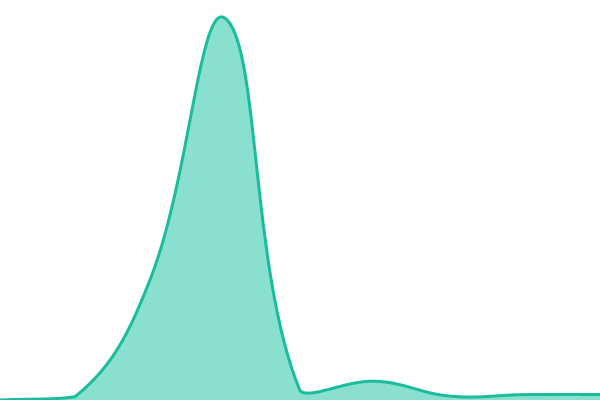

# [📈 Live Status](https://status.plone.org): <!--live status--> **🟩 All systems operational**

This repository contains the open-source uptime monitor and status page for [Plone](https://plone.org), powered by [Upptime](https://github.com/upptime/upptime).

With [Upptime](https://upptime.js.org), you can get your own unlimited and free uptime monitor and status page, powered entirely by a GitHub repository. We use [Issues](https://github.com/plone/plone-ping/issues) as incident reports, [Actions](https://github.com/plone/plone-ping/actions) as uptime monitors, and [Pages](https://status.plone.org) for the status page.

<!--start: status pages-->
<!-- This summary is generated by Upptime (https://github.com/upptime/upptime) -->
<!-- Do not edit this manually, your changes will be overwritten -->
<!-- prettier-ignore -->
| URL | Status | History | Response Time | Uptime |
| --- | ------ | ------- | ------------- | ------ |
|  [Plone.org](https://plone.org) | 🟩 Up | [plone-org.yml](https://github.com/plone/plone-ping/commits/HEAD/history/plone-org.yml) | 

 870ms
     
 | 

<a href="https://status.plone.org/history/plone-org">100.00%</a>
    

|  [Documentation](https://docs.plone.org) | 🟩 Up | [documentation.yml](https://github.com/plone/plone-ping/commits/HEAD/history/documentation.yml) | 

 350ms
     
 | 

<a href="https://status.plone.org/history/documentation">100.00%</a>
    

|  [Training](https://training.plone.org) | 🟩 Up | [training.yml](https://github.com/plone/plone-ping/commits/HEAD/history/training.yml) | 

 159ms
     
 | 

<a href="https://status.plone.org/history/training">100.00%</a>
    

|  [Community](https://community.plone.org) | 🟩 Up | [community.yml](https://github.com/plone/plone-ping/commits/HEAD/history/community.yml) | 

 258ms
     
 | 

<a href="https://status.plone.org/history/community">100.00%</a>
    

|  [CI (Jenkins)](https://jenkins.plone.org) | 🟩 Up | [ci-jenkins.yml](https://github.com/plone/plone-ping/commits/HEAD/history/ci-jenkins.yml) | 

 9359ms
     
 | 

<a href="https://status.plone.org/history/ci-jenkins">100.00%</a>
    

|  [Static Files](https://dist.plone.org) | 🟩 Up | [static-files.yml](https://github.com/plone/plone-ping/commits/HEAD/history/static-files.yml) | 

 136ms
     
 | 

<a href="https://status.plone.org/history/static-files">100.00%</a>
    

|  [Plone Brasil](https://plone.org.br) | 🟩 Up | [plone-brasil.yml](https://github.com/plone/plone-ping/commits/HEAD/history/plone-brasil.yml) | 

 892ms
     
 | 

<a href="https://status.plone.org/history/plone-brasil">100.00%</a>
    

|  [Plone Conference 2026](https://2026.ploneconf.org) | 🟩 Up | [plone-conference-2026.yml](https://github.com/plone/plone-ping/commits/HEAD/history/plone-conference-2026.yml) | 

 791ms
     
 | 

<a href="https://status.plone.org/history/plone-conference-2026">100.00%</a>
    

|  [Plone Conference 2025](https://2025.ploneconf.org) | 🟩 Up | [plone-conference-2025.yml](https://github.com/plone/plone-ping/commits/HEAD/history/plone-conference-2025.yml) | 

 961ms
     
 | 

<a href="https://status.plone.org/history/plone-conference-2025">100.00%</a>
    

|  [Plone Conference 2024](https://2024.ploneconf.org) | 🟩 Up | [plone-conference-2024.yml](https://github.com/plone/plone-ping/commits/HEAD/history/plone-conference-2024.yml) | 

 1133ms
     
 | 

<a href="https://status.plone.org/history/plone-conference-2024">100.00%</a>
    

|  [Demo Site](https://demo.plone.org) | 🟩 Up | [demo-site.yml](https://github.com/plone/plone-ping/commits/HEAD/history/demo-site.yml) | 

 740ms
     
 | 

<a href="https://status.plone.org/history/demo-site">37.83%</a>
    

<!--end: status pages-->

[**Visit our status website →**](https://status.plone.org)

## 📄 License

- Powered by: [Upptime](https://github.com/upptime/upptime)
- Code: [MIT](./LICENSE) © [Anand Chowdhary](https://anandchowdhary.com)
- Data in the `./history` directory: [Open Database License](https://opendatacommons.org/licenses/odbl/1-0/)
